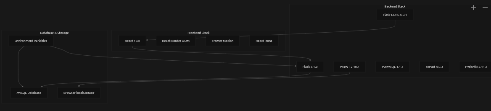
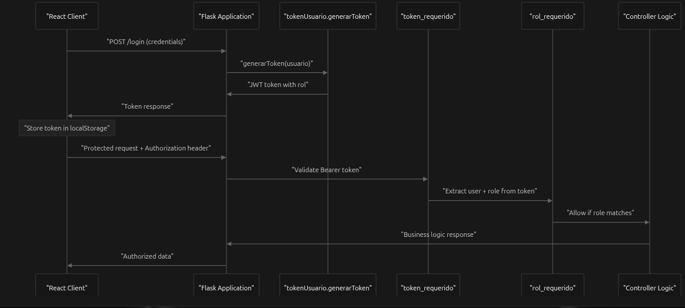

# 🚀 Cursos Deportivos: Full-Stack Platform

<p align="left">
  
  
  
  
  
</p>

### 📖 Descripción del Proyecto
Esta plataforma robusta para la gestión de actividades deportivas fue desarrollada como parte de mi formación en el último año de **Ingeniería de Sistemas** en la **Universidad Adventista de Bolivia (UAB)**. La aplicación integra una arquitectura escalable diseñada bajo principios de seguridad de grado industrial y orquestación moderna.

---

## 📌 Tabla de Contenidos
- [🛠️ Características Técnicas](#️-características-técnicas)
- [📐 Arquitectura y Seguridad](#-arquitectura-y-seguridad)
- [🐳 Ejecución con Docker (Recomendado)](#-ejecución-con-docker-recomendado)
- [⚙️ Instalación Manual](#️-instalación-manual)
- [📉 Roadmap (Kaizen)](#-roadmap-kaizen)

---

## 🛠️ Características Técnicas

* **🛡️ Seguridad Avanzada:** Implementación de **JWT (JSON Web Tokens)** y **RBAC (Role-Based Access Control)** para la gestión de permisos granulares.
* **🐳 Dockerización Profesional:** Orquestación completa mediante **Docker Compose**, incluyendo optimización de imágenes con `.dockerignore`.
* **🧩 Arquitectura Desacoplada:** Backend en **Python** sirviendo una API REST a un cliente dinámico en **React**.
* **🌱 Filosofía Kaizen:** Aplicación de mejora continua en la estructura y despliegue del software.

---

## 📐 Arquitectura y Seguridad
> *Los diagramas detallados se encuentran en la carpeta `/docs`.*

### 1. Arquitectura del Sistema
Interacción entre contenedores de React, Python y MySQL.



### 2. Seguridad (JWT & RBAC)
Flujos técnicos de autenticación y middlewares de autorización.



---

## 🐳 Ejecución con Docker (Recomendado)

Esta es la forma más rápida de desplegar el proyecto completo sin instalar dependencias locales.

1. **Asegúrate de tener Docker y Docker Compose instalados.**
2. **Configura tu archivo `.env` en la raíz.**
3. **Levanta los servicios:**
   ```bash
   docker-compose up --build
   ```

El sistema estará disponible en:
* Frontend: `http://localhost:5173`
* Backend API: `http://localhost:5000`
* Base de Datos: `http://localhost:3306`

---

## ⚙️ Instalación Manual

Si prefieres ejecutarlo fuera de Docker:

### 1. Backend
```bash
cd backend
python -m venv venv
source venv/bin/activate # Windows: venv\Scripts\activate
pip install -r requirements.txt
python app.py
```

### 2. Frontend
```bash
cd ../frontend
npm install
npm run dev
```

---

## 📉 Roadmap (Kaizen)

* [x] 🐳 **Dockerización:** Orquestación con Docker Compose e ignorado de archivos basura.
* [ ] 🤖 **CI/CD:** Implementación de pipelines con GitHub Actions.
* [ ] ☁️ **Cloud:** Migración y despliegue en infraestructura de AWS.

---

**Developed by Alvaro Rivera** - Systems Engineering Student @ UAB.  
📫 **Contact:** alvaro.regulo.rivera@gmail.com